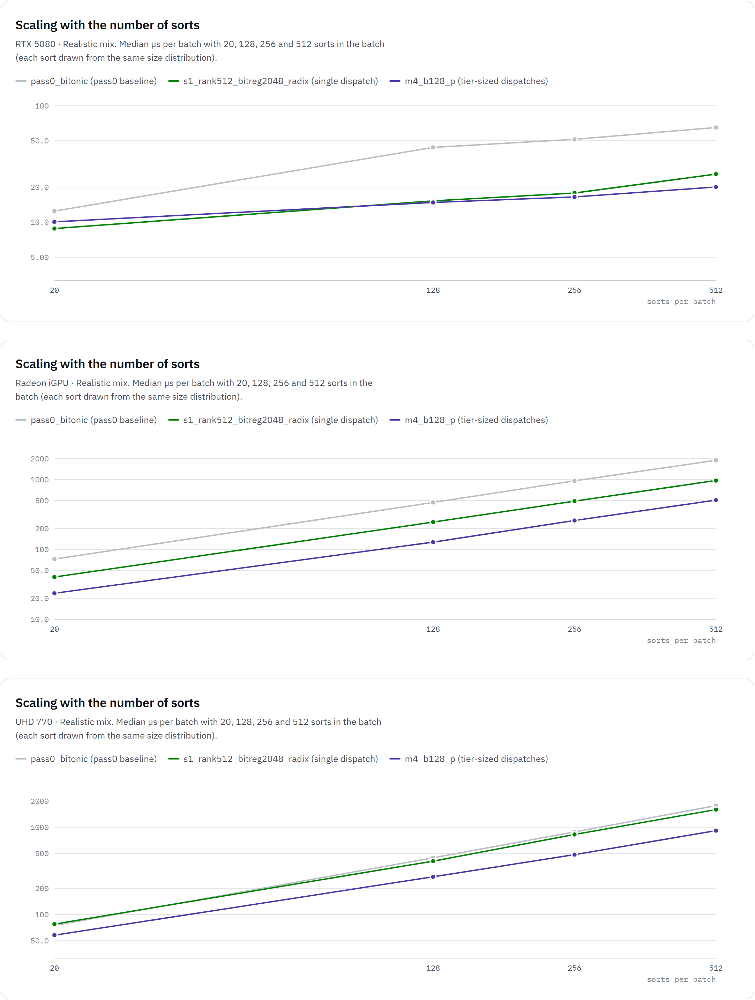
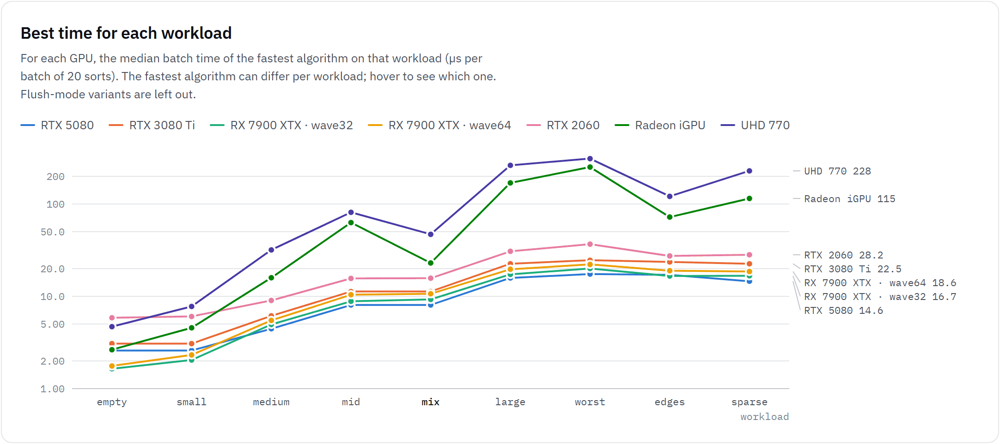
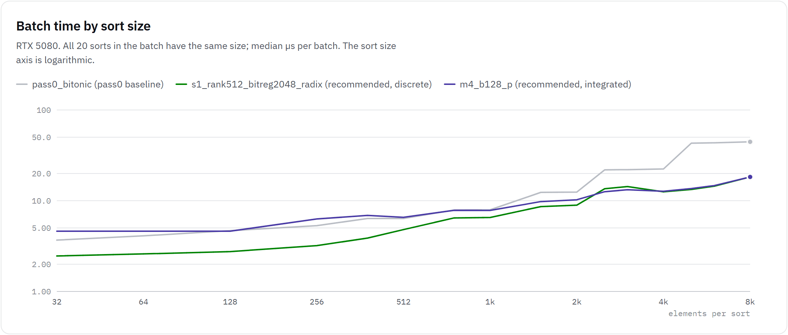
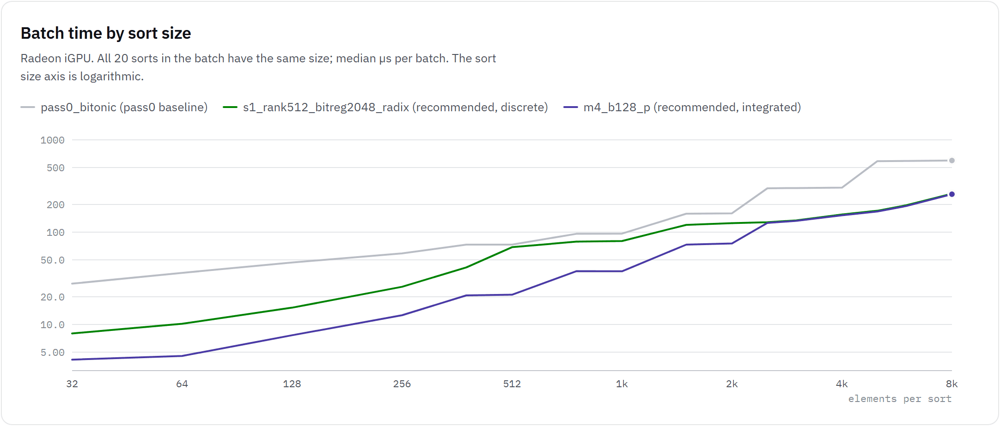
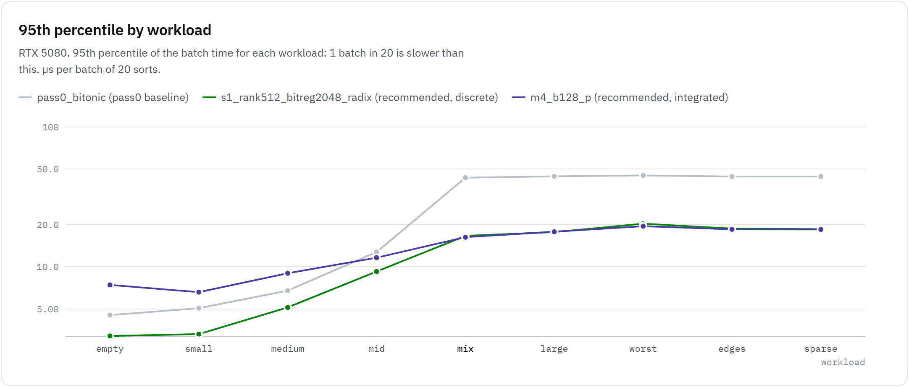
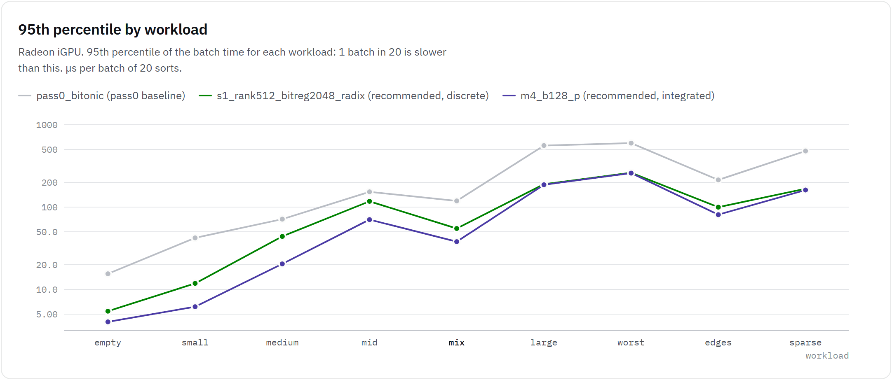
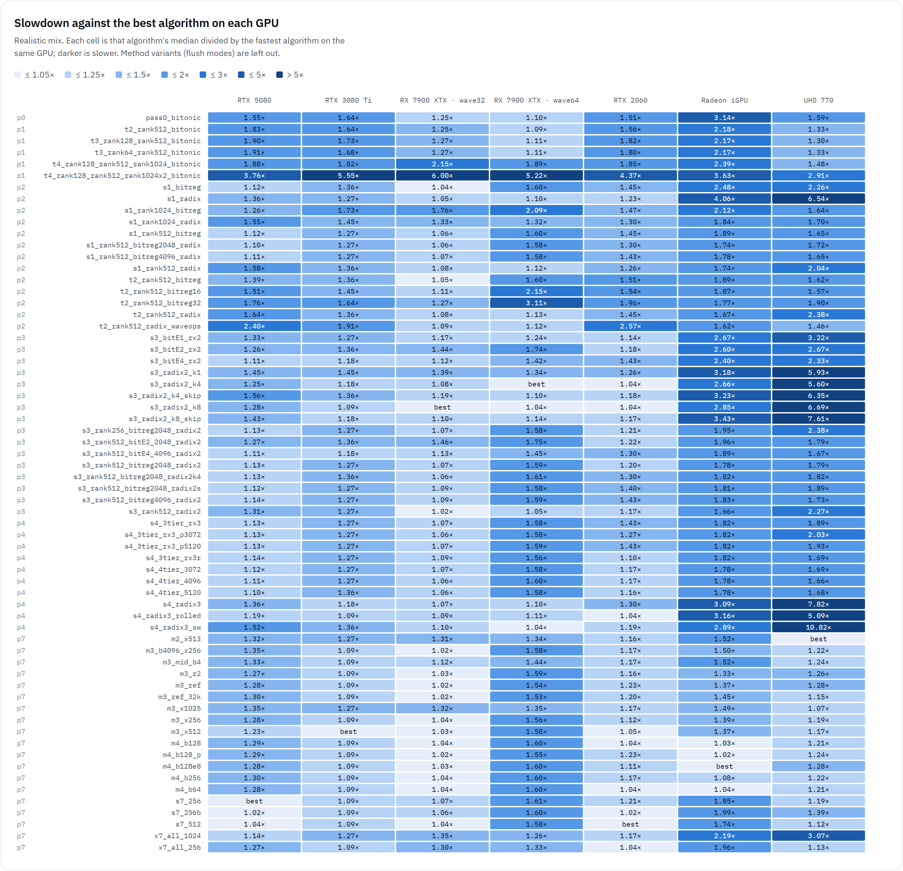

# gpu_single_pass_sort

A DX12 / Shader Model 6.6 GPU sort for many small sorts per frame, plus the benchmark framework
used to tune it on high-end and low-end GPUs.

The use case is sorting draw calls. A frame has about 20 sorts. Each sort has 0 to 8192 elements,
and most are small. An element is one `uint`: a 16-bit key in the high half and a 16-bit payload in
the low half. Each sort runs in one thread group, from load to store, with the whole sort in
registers and groupshared memory. All sorts of a frame go out in one dispatch (or a few, one per
size tier), back to back with no barriers between them.

The original task brief is in [docs/task_brief.md](docs/task_brief.md). The design discussion
that started it is in [gpu-sorting-notes.md](gpu-sorting-notes.md).

Contents:

- [Motivation](#motivation)
- [Results](#results)
- [Charts](#charts)
- [Integration guide](#integration-guide)
- [Algorithm catalogue](#algorithm-catalogue)
- [Benchmark framework](#benchmark-framework)
- [Development history](#development-history)
- [Repository layout](#repository-layout)

## Motivation

Large-N GPU sorts (Onesweep-style radix, FidelityFX Parallel Sort, CUB device radix sort) make
several global passes, each a dispatch followed by a barrier. At a few hundred to a few thousand
elements, the cost is the dispatches, barriers and pipeline bubbles, not the sorting work
([gpu-sorting-notes.md](gpu-sorting-notes.md), section 4). The bitonic chain this project
replaces needs 1 + d + d(d+1)/2 dispatches per sort: 10 dispatches for 8192 elements with
1024-element blocks.

8192 32-bit elements take 32 KB, which is exactly the D3D12 groupshared limit. So every sort fits
in one thread group. The design follows from that:

- One group per sort. A buffer of `{offset, count}` descriptors tells each group what to sort.
- The group picks its algorithm by size with a group-uniform branch on `count`. That branch is free.
- No global passes, no barriers between sorts, and no indirect-args setup shader.

The goal was to be as fast as possible on both low-end and high-end GPUs. The result is one
default configuration with tier-sized dispatches, `m4_b128_p`, that holds up from 20 to 512 sorts
per batch on every NVIDIA and AMD GPU measured, plus a single-dispatch alternative for the RTX 5080
with batches of about 20 sorts. On the Intel UHD 770 `m4_b128_p` is correct but not the fastest;
an Intel-tuned configuration is still open (see [Results](#results)).

## Results

### GPUs tested

| GPU | class | wave size | iterations |
|---|---|---|---:|
| NVIDIA GeForce RTX 5080 (Blackwell, 84 SMs) | discrete | 32 | 1000 |
| NVIDIA GeForce RTX 3080 Ti (Ampere) | discrete | 32 | 1000 |
| NVIDIA GeForce RTX 2060 (Turing) | discrete | 32 | 1000 |
| AMD Radeon RX 7900 XTX (RDNA3) | discrete | 32 (default, `[WaveSize(32)]`) and 64 | 1000 |
| AMD Radeon Graphics, Ryzen 7000 iGPU (RDNA2, 2 CUs) | integrated | 32 | 300 |
| Intel UHD Graphics 770 (Xe-LP, 32 EUs), in an i9-13900K machine | integrated | 16 | 300 |

The GPUs are in three machines: RTX 5080 + RTX 2060; RX 7900 XTX + Ryzen iGPU; and an i9-13900K
with an RTX 3080 Ti and the UHD 770 (Intel driver 32.0.101.6129). A UHD 770 in a different machine
(i7-12700, driver 31.0.101.3616) ran the earlier pass4 shaders with 0 verification failures; see
[_test/external/notes.md](_test/external/notes.md). The
[scale run](#scaling-with-more-sorts-per-batch) (20 to 512 sorts per batch) covers every GPU above
except the RTX 2060, which is pending; the RX 7900 XTX ran it at wave32 only.

### Final run

The final run used all 69 algorithms in
[shaders/algorithms_final.txt](shaders/algorithms_final.txt) on every GPU above. Each GPU ran 10
workloads. Every iteration was verified, with 0 verification failures and no
GPU errors ([_test/final/notes.md](_test/final/notes.md)).

Median µs per batch of 20 sorts, with the default measurement (`full_d50`, see
[Measurement](#measurement-method)). Bold marks the configuration the final run recommended for
each GPU class at 20 sorts per batch; the [scale run](#scaling-with-more-sorts-per-batch) replaced
that with one default, `m4_b128_p` (see [Recommendation](#recommendation)).

| GPU | algorithm | mostly_empty | realistic_mix | mostly_mid | worst_case |
|---|---|---:|---:|---:|---:|
| RTX 5080 | `pass0_bitonic` (baseline) | 4.06 | 12.51 | 12.38 | 44.56 |
| RTX 5080 | **`s1_rank512_bitreg2048_radix`** | **2.69** | **8.88** | **8.70** | **18.27** |
| RTX 5080 | `m4_b128_p` | 4.90 | 10.38 | 9.60 | 18.30 |
| RTX 2060 | `pass0_bitonic` (baseline) | 8.29 | 23.70 | 23.97 | 91.30 |
| RTX 2060 | **`s1_rank512_bitreg2048_radix`** | **6.14** | **20.42** | **17.89** | **38.34** |
| RTX 2060 | `m4_b128_p` | 6.75 | 19.39 | 20.99 | 38.37 |
| RTX 3080 Ti | `pass0_bitonic` (baseline) | 5.12 | 18.43 | 18.43 | 62.46 |
| RTX 3080 Ti | **`s1_rank512_bitreg2048_radix`** | **3.07** | **14.34** | **14.34** | **24.58** |
| RTX 3080 Ti | `m4_b128_p` | 3.07 | 12.29 | 11.26 | 24.58 |
| RX 7900 XTX wave32 | `pass0_bitonic` (baseline) | 3.08 | 11.54 | 11.56 | 41.48 |
| RX 7900 XTX wave32 | **`s1_rank512_bitreg2048_radix`** | **1.76** | **9.84** | **9.88** | **20.08** |
| RX 7900 XTX wave32 | `m4_b128_p` | 1.80 | 9.44 | 9.32 | 20.06 |
| RX 7900 XTX wave64 | `pass0_bitonic` (baseline) | 3.08 | 11.72 | 11.60 | 41.72 |
| RX 7900 XTX wave64 | `s1_rank512_bitreg2048_radix` | 1.96 | 16.84 | 16.96 | 22.32 |
| RX 7900 XTX wave64 | `m4_b128_p` | 2.04 | 16.44 | 16.56 | 22.32 |
| Radeon iGPU | `pass0_bitonic` (baseline) | 10.76 | 72.22 | 141.56 | 597.16 |
| Radeon iGPU | `s1_rank512_bitreg2048_radix` | 4.40 | 40.06 | 109.34 | 260.60 |
| Radeon iGPU | **`m4_b128_p`** | **3.88** | **23.40** | **63.96** | **257.76** |
| UHD 770 | `pass0_bitonic` (baseline) | 14.01 | 74.71 | 138.98 | 595.47 |
| UHD 770 | `s1_rank512_bitreg2048_radix` | 7.08 | 80.55 | 244.58 | 511.07 |
| UHD 770 | **`m4_b128_p`** | **12.40** | **58.38** | **123.54** | **518.78** |

Workloads (all 20 sorts per batch): mostly_empty = 70 % empty, rest 1-64; realistic_mix = 15 %
empty, 72 % 16-512, 10 % 513-2048, 3 % 2049-8192; mostly_mid = uniform 513-2048; worst_case = all
8192. The full list is under [Benchmark framework](#workloads). The RTX 3080 Ti's timestamps tick
in 1.024 µs steps, so its medians are multiples of 1.024 µs.

The tail matters as much as the median. On the RTX 5080, realistic_mix has a p95 of 43.39 µs with
`pass0_bitonic` and 16.64 µs with `s1_rank512_bitreg2048_radix`. The p95 comes from the rare
batches that contain a 2049-8192 sort.

### Scaling with more sorts per batch

Everything above is for 20 sorts per batch. With 20 sorts most of the GPU is idle, which hides
that a single-dispatch configuration launches a 1024-thread group for every sort, even an empty
or a 16-element one. The scale run ([_test/scale/notes.md](_test/scale/notes.md)) measured 19
algorithms ([shaders/algorithms_scale.txt](shaders/algorithms_scale.txt)) at 20, 128, 256 and 512
sorts per batch on the RTX 5080, RTX 3080 Ti, RX 7900 XTX, Radeon iGPU and Intel UHD 770, with 0
verification failures. The RTX 2060 is pending.

Median µs per batch on realistic_mix. In parentheses: the time divided by the fastest of the 19
algorithms on that GPU at that batch size.

| GPU | algorithm | 20 sorts | 128 sorts | 256 sorts | 512 sorts |
|---|---|---:|---:|---:|---:|
| RTX 5080 | `s1_rank512_bitreg2048_radix` | 8.80 (1.10x) | 15.22 (1.04x) | 17.79 (1.08x) | 25.87 (1.31x) |
| RTX 5080 | `m4_b128_p` | 10.06 (1.25x) | 14.75 (1.00x) | 16.46 (1.00x) | 20.03 (1.01x) |
| RTX 5080 | fastest | 8.03 `s7_256` | 14.69 `m3_ref` | 16.46 `m4_b128_p` | 19.78 `m3_ref` |
| RTX 3080 Ti | `s1_rank512_bitreg2048_radix` | 14.34 (1.27x) | 21.50 (1.00x) | 26.62 (1.13x) | 39.94 (1.44x) |
| RTX 3080 Ti | `m4_b128_p` | 11.26 (1.00x) | 21.50 (1.00x) | 23.55 (1.00x) | 27.65 (1.00x) |
| RTX 3080 Ti | fastest | 11.26 `m3_x512` | 21.50 `s1_rank512_bitreg2048_radix` | 23.55 `m3_ref` | 27.65 `m4_b128_p` |
| RX 7900 XTX | `s1_rank512_bitreg2048_radix` | 9.92 (1.05x) | 15.24 (1.00x) | 18.90 (1.11x) | 28.88 (1.43x) |
| RX 7900 XTX | `m4_b128_p` | 9.44 (1.00x) | 15.56 (1.02x) | 17.00 (1.00x) | 20.14 (1.00x) |
| RX 7900 XTX | fastest | 9.44 `m4_b128_p` | 15.24 `s1_rank512_bitreg2048_radix` | 17.00 `m4_b128_p` | 20.14 `m4_b128_p` |
| Radeon iGPU | `s1_rank512_bitreg2048_radix` | 40.18 (1.74x) | 245.96 (1.93x) | 490.66 (1.89x) | 969.52 (1.91x) |
| Radeon iGPU | `m4_b128_p` | 23.52 (1.02x) | 127.12 (1.00x) | 259.54 (1.00x) | 508.72 (1.00x) |
| Radeon iGPU | fastest | 23.06 `m4_b128e8` | 127.12 `m4_b128_p` | 259.54 `m4_b128_p` | 508.72 `m4_b128_p` |
| UHD 770 | `s1_rank512_bitreg2048_radix` | 77.55 (1.48x) | 408.67 (2.20x) | 826.07 (2.17x) | 1592.5 (2.18x) |
| UHD 770 | `m4_b128_p` | 57.89 (1.11x) | 270.37 (1.46x) | 485.23 (1.27x) | 914.38 (1.25x) |
| UHD 770 | fastest | 52.24 `x7_all_256` | 185.75 `m4_b256` | 381.48 `m4_b256` | 729.63 `m4_b128e8` |

On the RTX 3080 Ti several algorithms often tie (1.024 µs timestamp steps); the table names one.

RTX 5080 (top), Radeon iGPU (middle) and Intel UHD 770 (bottom), realistic_mix, log scale:



- **Mixed batches need tier-sized groups.** Once the GPU is busy, a 1024-thread group for a
  50-element sort takes occupancy that the other sorts need. `m4_b128_p` is the fastest or within
  2 % of the fastest at every batch size on the RTX 5080, RTX 3080 Ti, RX 7900 XTX and Radeon iGPU,
  except 20 sorts on the RTX 5080. The single dispatch falls behind as the batch grows: at 512
  sorts it is 1.31x (RTX 5080), 1.44x (RTX 3080 Ti), 1.43x (RX 7900 XTX), 1.91x (Radeon iGPU) and
  2.18x (UHD 770) slower than the fastest.
- **Large sorts need 1024-thread groups on most GPUs.** On worst_case (all 8192), on the RTX 5080,
  the RX 7900 XTX and the Radeon iGPU, every configuration that sorts 2049+ with the pass2 LDS
  radix in 1024-thread groups (`s1_*`, `m3_ref`, `m4_b128_p`) is within 8 % of the fastest at
  every batch size. The configurations with the 256-thread ballot radix are 1.5-1.7x slower there
  at 512 sorts. More, smaller groups do not make up for the slower algorithm even when the GPU is
  full. `m4_b128_p` keeps the 1024-thread radix for its large tier, which is why it holds up on
  both workloads. Two GPUs differ: on the RTX 3080 Ti the ballot radix in 256- and 512-thread
  groups is faster from 128 sorts (512 sorts: `s7_256b` 165.89 vs `m4_b128_p` 189.44 µs), and on
  the UHD 770 much faster (next point).
- **The Intel UHD 770 wants smaller groups for large sorts too.** `s7_512` (one dispatch, ballot
  radix in 512-thread groups above 2048) is the fastest on worst_case at every batch size, 1.52-1.79x
  faster than `m4_b128_p`; `x7_all_256` (ballot radix in 256 threads for every size) is the fastest
  on mostly_mid at every batch size, 1.34-1.53x faster. On realistic_mix the fastest at 128-512
  sorts are `m4_b256` and `m4_b128e8`; `m4_b128_p` is 1.25-1.46x slower there (1.11x at 20
  sorts). Most of the gap is the large tier: `m4_b128`, which has the same tiers as `m4_b128_p`
  except the ballot radix in 256 threads for 2049+, takes 191.28 vs 270.37 µs at 128 sorts. No
  configuration of the set is the fastest on Intel everywhere.
- **The 129-512 tier can still be tuned for large batches.** On mostly_medium (uniform 129-512)
  at 512 sorts, `m4_b128e8` (bitonic E8 instead of E4 in the 128-thread tier) is 21 % faster
  than `m4_b128_p` on the RX 7900 XTX (11.84 vs 14.92 µs) and 16 % faster on the Radeon iGPU. On
  the RTX 5080, `t2_rank512_bitonic` (rank sort in 512-thread groups) is the fastest at every
  batch size (12.13 vs 17.46 µs at 512 sorts). `m4_b128e8` is also the fastest on the RTX 3080 Ti
  at 512 sorts (14.34 vs 19.46 µs). Neither is better than `m4_b128_p` across all workloads yet.

### Recommendation

- **Default, every GPU: `m4_b128_p`.** Four dispatches with tier-sized groups: rank sort up to
  128 elements in 128 threads, bitonic E4 for 129-512 in 128 threads, bitonic E8 for 513-2048 in
  256 threads, and the pass2 LDS radix above 2048 in 1024 threads. On realistic_mix it is the
  fastest or within 2 % of the fastest of the 19 scale-run algorithms at 20 to 512 sorts per
  batch on the RTX 5080, RTX 3080 Ti, RX 7900 XTX and Radeon iGPU (the exception: 20 sorts on the
  RTX 5080), and on worst_case it is within 7 % on the RTX 5080, RX 7900 XTX and Radeon iGPU (14 %
  on the RTX 3080 Ti). At 20 sorts it is 1.7x faster than `s1_rank512_bitreg2048_radix` on the
  Ryzen iGPU (realistic_mix 23.4 vs 40.1 µs, mostly_mid 64.0 vs 109.3 µs), 1.4x on the UHD 770
  (realistic_mix 58.38 vs 80.55 µs), about 5 % faster on the RX 7900 XTX and on the RTX 2060
  (realistic_mix), and 3.1x faster than `pass0_bitonic` on the iGPU. Its weak spot is batches of
  only tiny sorts (mostly_empty: 1.00-2.25x the fastest on the NVIDIA and AMD GPUs), where the
  absolute times are small.
- **High-end NVIDIA with batches of about 20 sorts: `s1_rank512_bitreg2048_radix`.** One
  1024-thread dispatch that uses 32 KB of groupshared memory: rank sort up to 512 elements,
  register bitonic up to 2048, LDS radix above. It avoids the multi-dispatch cost, which is large
  on the RTX 5080: at 20 sorts it beats `m4_b128_p` by 13 % on realistic_mix (8.80 vs 10.06 µs)
  and by 45 % on mostly_empty (2.69 vs 4.90 µs, final run). It loses that lead as the batch
  grows: 15.22 vs 14.75 µs at 128 sorts, 1.29x slower at 512. This lead was measured on the RTX
  5080 only. The RTX 3080 Ti does not show it: there `m4_b128_p` equals or beats it on
  realistic_mix at every batch size (11.26 vs 14.34 µs at 20 sorts). On the RTX 2060 at 20 sorts
  (final run) it is faster on mostly_empty and mostly_mid but 5 % slower on realistic_mix, and
  the 2060's scale run is pending.
- **AMD: wave32.** This is the default (`WAVE_SIZE=32` + `[WaveSize(32)]`). On the RX 7900 XTX,
  wave64 costs about 70 % on realistic_mix and mostly_mid (16.84 vs 9.84 µs for `s1_...`) and
  about 10 % on worst_case.
- **Intel: `m4_b128_p` for now, with a caveat.** On the UHD 770 (wave16) it is correct (0
  verification failures) and 1.3-1.7x faster than `s1_rank512_bitreg2048_radix` on realistic_mix
  at every batch size, but 1.11-1.46x slower than the fastest configuration there, and 1.52-1.79x
  slower than `s7_512` on worst_case. An Intel-tuned tier set (the ballot radix in 256- or
  512-thread groups for the large tier) is an open item.
- Pending: the RTX 2060 in the scale run.

Caveats at 20 sorts per batch, from [_test/final/notes.md](_test/final/notes.md):

- Everywhere except the RTX 2060 and the UHD 770, the better of `m4_b128_p` and
  `s1_rank512_bitreg2048_radix` is within about 10 % of the fastest of all 69 algorithms. On the
  RTX 2060, `s7_512` (one 512-thread dispatch) is 19 % faster on realistic_mix (15.71 µs) and 13 %
  faster on mostly_mid. It is slower on large sorts on the AMD GPUs, though (worst_case: 30.88 vs
  20.08 µs on the 7900 XTX, 321.8 vs 260.6 µs on the iGPU). On the UHD 770 the fastest entries are
  1.24x faster on realistic_mix (`m2_x513` 46.95 µs), 1.52x on mostly_mid (`x7_all_256` 81.22 µs)
  and 1.65x on worst_case (`s7_512` 310.23 µs).
- The RTX 2060's timestamps are quantized in steps of about 1.024 µs, so its small-workload
  medians are only accurate to about ±1 µs. The RTX 3080 Ti's are quantized in steps of exactly
  1.024 µs (every sample), with the same consequence.

### Lessons learned

Each point links to the pass notes where it was measured.

- **The largest sort in the batch sets the latency.** The 20 groups run concurrently, so a single
  8k sort sets the time for a batch of otherwise small sorts. With `pass0_bitonic`, mostly_large
  measures almost the same as worst_case ([pass0](_test/pass0/notes.md)).
- **Pick the algorithm per size, inside the group:**
  - **Rank sort up to 512.** One barrier, broadcast LDS reads, and stable through a
    `(key << 16) | index` word. The crossover to bitonic on the RTX 5080 is between 512 and 768.
    A rank tier up to 1024 does not pay ([pass1](_test/pass1/notes.md),
    [pass2](_test/pass2/notes.md), [pass3](_test/pass3/notes.md)). On AMD, bitonic in a
    128-thread group wins 129-512 ([pass7](_test/pass7/notes.md)).
  - **Register/wave bitonic for 513-2048.** It keeps 8 elements per thread in registers, does
    lane stages with `WaveReadLaneAt`, and uses LDS only for transposes. That is 10 barriers at
    8192 elements instead of 91 ([pass2](_test/pass2/notes.md)).
  - **16-bit LSD radix above 2048.** 4 passes of 4-bit digits in LDS. Its fixed cost does not
    shrink with the count (about 11 µs on the RTX 5080 even for tiny sorts), so it only wins for
    large sorts. The bitonic/radix crossover is exactly at 2048, the point where bitonic's padding
    to the next power of two jumps. The iGPUs confirm 2048 ([pass3](_test/pass3/notes.md),
    [external](_test/external/notes.md)).
- **Every extra dispatch costs something, even an empty one.** Each additional ExecuteIndirect
  added about 0.1-0.3 µs to small workloads on the RTX 5080. An empty dispatch in front of the
  bitonic dispatch delayed it by about 1.2 µs ([pass1](_test/pass1/notes.md)). In pass7,
  multi-dispatch cost 1.1-1.6 µs on the RTX 5080's small workloads ([pass7](_test/pass7/notes.md)).
  One dispatch is best on high-end GPUs, but only while the batch is small: at 128 sorts per batch
  the single and the tier-sized dispatches are about even, and at 512 sorts `m4_b128_p` is 1.3-1.4x
  faster than `s1_rank512_bitreg2048_radix` on the discrete GPUs ([scale](_test/scale/notes.md)).
- **Integrated GPUs are limited by occupancy, not latency. They want tier-sized groups.** The
  Ryzen iGPU holds at most two 1024-thread groups at a time. Putting the same algorithms in
  tier-sized groups with tier-sized LDS cut mostly_mid by 41 %, and bitonic in 128-thread groups
  cut mostly_medium by 48 %. The gain comes mostly from the thread count, not the LDS size. A
  single dispatch with smaller groups does not get it, because every group reserves the largest
  tier's LDS and threads ([pass7](_test/pass7/notes.md)). Discrete GPUs behave the same once a
  batch has a few hundred sorts ([scale](_test/scale/notes.md)). The Intel UHD 770 goes further:
  even its large tier is faster in 512-thread groups (worst_case at 20 sorts: `s7_512` 310.23 vs
  511.07 µs for the 1024-thread pass2 radix in `s1_rank512_bitreg2048_radix`), as the pass4 numbers
  had suggested ([external](_test/external/notes.md), [final](_test/final/notes.md)).
- **Wave intrinsics are not equally cheap.** On NVIDIA (driver 32.0.16.1714), `WavePrefixSum` costs
  6.4x a `WaveReadLaneAt` shuffle and `WaveMatch` 8.6x. `WaveActiveSum`, `WaveActiveBallot` and
  `WavePrefixCountBits` cost the same as a shuffle ([pass3](_test/pass3/notes.md)). Replacing the
  radix's `WavePrefixSum` scans with shuffle scans made it 3 µs faster on the RTX 5080 and
  15-18 µs faster on the RTX 2060 ([pass2](_test/pass2/notes.md)).
- **Cold shader code is a real cost.** The sort runs once per frame, so its code is cold. On the
  RTX 5080, the first radix sizes after a switch from the bitonic path cost +3.3 / +3.7 µs. The
  fully unrolled radix_sort3 cost up to +8.9 µs. A rolled pass loop removed the penalty. Straight
  code streams well, so the shape of the code matters more than its size: every jump into cold
  code waits for memory ([pass4](_test/pass4/notes.md), [pass5](_test/pass5/notes.md)).
- **Wave64 on RDNA is slower, and it exposed a correctness bug.** On the 7900 XTX, the bitonic
  tier is about 70 % slower at wave64. On the Ryzen iGPU, bitonic and radix_sort2 collapse at wave64
  (bitonic about 8x slower).
  The pass2 radix gave wrong results at wave64. The most likely cause is a driver miscompile of
  its shuffle scans, but that is not confirmed. The fix: at waves wider than 32 lanes, use wave
  intrinsics for the scans and 32-lane virtual waves for bitonic ([pass4](_test/pass4/notes.md),
  [pass5](_test/pass5/notes.md), [external](_test/external/notes.md)).
- **Measuring microseconds needs care.** A 256 MB cache flush runs before every batch. On the
  RX 7900 XTX, its write-back still overlapped the timed sort by about 13 µs. That penalty decays
  with the wait after the flush, and is gone after about 50 µs. So the default became a 50 µs
  ALU-only "spin" drain between the flush and the start timestamp (`full_d50`)
  ([pass5](_test/pass5/notes.md), [external](_test/external/notes.md)). With the drain, a batch
  on the RTX 5080 pays 1.2-1.7 µs for cold data and 0.8-1.1 µs for cold code.

## Charts

These images come from the interactive results page. Each value is the median µs per batch of 20
sorts in the final run. The scaling chart (20 to 512 sorts per batch) is under
[Scaling with more sorts per batch](#scaling-with-more-sorts-per-batch).

**Best time for each workload.** For each GPU, the fastest algorithm on each workload:



**Batch time by sort size** (sweep workload: all 20 sorts in a batch have the same size). The
first chart is the RTX 5080, the second the Radeon iGPU:





**95th percentile by workload.** The first chart is the RTX 5080, the second the Radeon iGPU:





**Slowdown against the best algorithm on each GPU, realistic_mix.** Each cell is that algorithm's
median divided by the fastest algorithm's median on the same GPU:

<details>
<summary>Heatmap (64 algorithms x 7 GPU configurations)</summary>



</details>

### Interactive page and raw data

- Interactive page, published: <https://claude.ai/artifact/3PHgWLiq9ej94L2pM3wWZZ>. This link is
  private: only people it has been shared with can open it.
- Local copy: open [tools/results_page/index.html](tools/results_page/index.html) in a browser.
  The file is an HTML fragment that loads `data.js` and `scale.js` from its own folder, so keep
  the files together. Regenerate `data.js` with [tools/results_page/prep.py](tools/results_page/prep.py)
  and `scale.js` with [tools/results_page/prep_scale.py](tools/results_page/prep_scale.py) (see
  [tools/results_page/README.md](tools/results_page/README.md)).
- Raw data: [_test/final/all_results.csv](_test/final/all_results.csv) has one row per GPU x
  algorithm x workload. [_test/final/all_samples.csv.gz](_test/final/all_samples.csv.gz) has
  every measured iteration (3,864,000 rows). The scale run's data is in
  [_test/scale/all_results.csv](_test/scale/all_results.csv) (one row per GPU x algorithm x
  workload x sorts per batch) and [_test/scale/all_samples.csv.gz](_test/scale/all_samples.csv.gz)
  (1,128,600 rows). The columns are described in [tools/CSV_FORMAT.md](tools/CSV_FORMAT.md).

## Integration guide

This section describes the shaders as they are in [shaders/](shaders/). The recommended default,
`m4_b128_p`, uses two entry-point files: `radix_sort.hlsl` and `p7_sort.hlsl`. The alternative for
high-end NVIDIA GPUs with small batches, `s1_rank512_bitreg2048_radix`, uses `single_pass.hlsl`.
All three need their includes.

### Data layout

| binding | HLSL | content |
|---|---|---|
| `b0` | `cbuffer SortConstants { uint gNumSorts; uint pad[3]; }` | number of sorts |
| `t0` | `StructuredBuffer<uint2> gSortDescs` | per sort: `x` = offset in elements, `y` = count (0..8192) |
| `t1` | `StructuredBuffer<uint> gInput` | elements: `(key16 << 16) \| payload16` |
| `u0` | `RWStructuredBuffer<uint> gOutput` | sorted elements |

All bindings are in register space 0 ([shaders/common.hlsli](shaders/common.hlsli)).

- Sort `i` reads `gInput[offset .. offset + count)` and writes the sorted result to
  `gOutput[offset .. offset + count)`. It uses the same offset in both buffers. It writes nothing
  outside that range; the benchmark checks this with a poisoned output buffer every iteration.
- Input and output are separate buffers: an SRV and a UAV. **In-place sorting is not
  supported.** D3D12 does not allow one buffer to be bound as an SRV and a UAV at the same time.
  Changing `gInput` to alias the output UAV was never tested.
- The benchmark puts each sort at a 64-element-aligned offset. The shaders index with
  `offset + i` and do not depend on that alignment.
- The benchmark's root signature has two parameters: 4 root constants at `b0`, and a descriptor
  table with `t0`, `t1` and `u0`. It uses a descriptor table instead of root descriptors because
  typed views are bounds-checked: out-of-bounds reads return 0 and out-of-bounds writes are
  dropped. See `src/Benchmark.cpp`.

### Sort order and stability

Every configuration sorts ascending by the 16-bit key (bits 31..16). Elements with equal keys come
out in an order that depends on the building block that handles the sort's size:

| building block | compares | equal keys |
|---|---|---|
| rank sort (`rank_sort.hlsl`, `rank_sort1.hlsli`, `p7_rank.hlsli`) | `(key << 16) \| index` | stable (input order) |
| LDS radix sorts (`radix_sort*.hlsli`, `p7_radix.hlsli`) | 16-bit key | stable (input order) |
| bitonic sorts (`pass0_bitonic.hlsl`, `bitonic_reg*.hlsli`, `p7_bitonic.hlsli`) | the full 32-bit value | ordered by payload |

In `m4_b128_p`, sorts of 129-2048 elements take the bitonic path and all other sizes are stable.
In `s1_rank512_bitreg2048_radix`, sorts of 513-2048 take the bitonic path. If equal keys must come
out in input order at every size, use a payload that increases with input position, such as the
draw index in submission order. Then both orders are the same. The benchmark's verification only
checks key order and that the output is a permutation of the input.

### Compiling

The shaders are compiled with DXC for `cs_6_6` with HLSL 2021 (`-T cs_6_6 -E main -O3 -HV 2021`),
once per dispatch line, with these defines:

| define | meaning |
|---|---|
| `GROUP_SIZE` | threads per group, the number after the entry point in the dispatch line |
| `WAVE_SIZE` | lane count the driver really uses (power of two, 4..128) |
| `WAVE_SIZE_REQUIRED=1` | adds `[WaveSize(WAVE_SIZE)]` to the entry point; needed when the GPU supports a range of wave sizes |
| `MIN_COUNT`, `MAX_COUNT` | the size tier of this dispatch (default 1..8192); other sorts return at once |
| `RANK_MAX`, `BITREG_MAX`, `LARGE_RADIX` | `single_pass.hlsl` tiers: rank sort ≤ `RANK_MAX`, register bitonic ≤ `BITREG_MAX`, then radix (`LARGE_RADIX=1`) or bitonic (`0`) |
| `P7_RANK_MAX`, `P7_RANK_EPT`, `P7_BIT_MAX`, `P7_BIT_E`, `P7_BIT2_MAX`, `P7_BIT2_E`, `P7_LARGE`, `P7_LDS_WORDS` | `p7_sort.hlsl` tiers: rank sort (elements per thread), up to two bitonic tiers (elements per thread), large tier (1 = bitonic, 2 = ballot radix), and the groupshared size (default: the smallest power of two that fits the tier) |

The default and the alternative configuration, copied from
[shaders/algorithms_final.txt](shaders/algorithms_final.txt). The format of each line is
`dispatch <file> <entry> <GROUP_SIZE> <defines>`:

```
algorithm m4_b128_p                          # default, every GPU
dispatch radix_sort.hlsl main 1024 MIN_COUNT=2049
dispatch p7_sort.hlsl main 256 MIN_COUNT=513 MAX_COUNT=2048 P7_BIT_MAX=2048 P7_BIT_E=8
dispatch p7_sort.hlsl main 128 MIN_COUNT=129 MAX_COUNT=512 P7_BIT_MAX=512 P7_BIT_E=4
dispatch p7_sort.hlsl main 128 MAX_COUNT=128 P7_RANK_MAX=128

algorithm s1_rank512_bitreg2048_radix        # high-end NVIDIA, batches of about 20 sorts
dispatch single_pass.hlsl main 1024 RANK_MAX=512 BITREG_MAX=2048 LARGE_RADIX=1
```

(The `desc` lines in algorithms_final.txt and algorithms_scale.txt still call these the discrete
and the integrated recommendation. That was the final run's advice at 20 sorts per batch; the
lists are left unchanged so that their rows keep joining with the archived results.)

For example, the 129-512 tier of `m4_b128_p` on AMD RDNA:

```
dxc -T cs_6_6 -E main -O3 -HV 2021 -D GROUP_SIZE=128 -D WAVE_SIZE=32 -D WAVE_SIZE_REQUIRED=1 ^
    -D MIN_COUNT=129 -D MAX_COUNT=512 -D P7_BIT_MAX=512 -D P7_BIT_E=4 shaders\p7_sort.hlsl
```

### Dispatching

- Each dispatch line becomes one PSO. All PSOs of a configuration share the root signature, the
  root constants and the descriptor table.
- Dispatch one group per sort: `Dispatch(numSorts, 1, 1)`, or an `ExecuteIndirect` with the same
  arguments. Group `i` sorts descriptor `i`. Groups with an index ≥ `gNumSorts` return at once, so
  a fixed, larger group count also works.
- For a multi-dispatch configuration, record the dispatches back to back with only
  `SetPipelineState` in between and **no barriers**. Each dispatch sorts only the sizes in its
  tier, so the dispatches write disjoint output ranges and the GPU can run them concurrently.
- Put a UAV barrier (or a transition of the output buffer) after the last sort dispatch, before
  anything reads the output.
- Empty sorts, and sorts outside a dispatch's `MIN_COUNT..MAX_COUNT`, return before the first
  barrier and before loading any elements; they only read their descriptor.

### Choosing the configuration at runtime

```cpp
D3D12_FEATURE_DATA_ARCHITECTURE arch = {};           // NodeIndex 0
device->CheckFeatureSupport(D3D12_FEATURE_ARCHITECTURE, &arch, sizeof(arch));
D3D12_FEATURE_DATA_D3D12_OPTIONS1 o1 = {};
device->CheckFeatureSupport(D3D12_FEATURE_D3D12_OPTIONS1, &o1, sizeof(o1));

const UINT waveSize     = o1.WaveLaneCountMin;        // NVIDIA 32, AMD RDNA 32 (range 32-64), Intel UHD 770 16
const bool waveSizeAttr = o1.WaveLaneCountMin != o1.WaveLaneCountMax; // -> WAVE_SIZE_REQUIRED=1
// o1.WaveOps must be TRUE.

// Configuration: m4_b128_p unless all of these hold (then s1_rank512_bitreg2048_radix):
DXGI_ADAPTER_DESC1 desc = {};
adapter->GetDesc1(&desc);
const bool singleDispatch = desc.VendorId == 0x10DE   // NVIDIA
                         && !arch.UMA                 // discrete
                         && isHighEndGpu              // your own GPU list; measured: RTX 5080 (not the RTX 3080 Ti)
                         && typicalSortsPerBatch <= 20; // s1 won at 20 sorts, was even at 128, lost at 256+
```

Use `m4_b128_p` when in doubt: where `s1_rank512_bitreg2048_radix` wins (RTX 5080, 20 sorts), it
saves about 1.3 µs per batch on realistic_mix (8.80 vs 10.06 µs); where it loses, it costs up to
5.8 µs on the RTX 5080 and 8.7 µs on the RX 7900 XTX at 512 sorts, and 1.7-1.9x on the Radeon
iGPU. The measured batch sizes are 20, 128, 256 and 512; the crossover between 20 and 128 was
not measured. On Intel `m4_b128_p` is the better of the two but not the fastest configuration
(see [Recommendation](#recommendation)).

The wave-size part is what the benchmark does (`src/Device.cpp`, `src/main.cpp`). The shaders
assume that lane = `SV_GroupIndex % WAVE_SIZE` and that `WAVE_SIZE` is the real lane count. If the
driver can pick between several wave sizes, pin it with `[WaveSize]`. The benchmark's wave probe
checks both assumptions on every GPU before it runs.

### Limits

- At most 8192 elements per sort. `single_pass.hlsl` and `p7_sort.hlsl` clamp larger counts to
  8192, so only the first 8192 elements are sorted. The other tier entry points skip them. Nothing
  handles more than 8192 elements.
- The 1024-thread shaders use all 32 KB of groupshared memory. The `p7_sort.hlsl` tiers use only
  what their size range needs: 512 B for rank ≤ 128, 2 KB for 129-512, 8 KB for 513-2048.
- Needs Shader Model 6.6 and wave operations: `WaveReadLaneAt`, ballots, and prefix/active sums
  at wave64.
- Wave sizes that ran on hardware: 32 (NVIDIA, AMD), 64 (AMD), and 16 (Intel UHD 770: the pass4
  shaders on one machine, the final and scale sets on another, including the pass7 shaders
  `p7_*` that `m4_b128_p` uses, with 0 verification failures). WARP ran 4.

## Algorithm catalogue

### Building blocks

| name in the codename | what it is | introduced |
|---|---|---|
| LDS bitonic (`pass0_bitonic`, `bitonic` in pass1 names) | classic bitonic network in groupshared memory, a barrier after every stage (91 at 8192) | pass0 |
| `rank` | rank sort: an element's output position = the number of smaller `(key << 16) \| index` words; one barrier, stable. `x2` = 2 elements per thread | pass1 |
| `bitreg`, `bit`, `B<E>` | register/wave bitonic with E elements per thread (E1, E2, E4, E8, 16, 32): register stages, `WaveReadLaneAt` lane stages, LDS transposes; `bitreg` alone = E8 | pass2 (E8/16/32), pass3 (E1/E2/E4) |
| `radix`, `P` | LDS radix sort: 16-bit key, 4 x 4-bit LSD passes, 1024 threads, 11 barriers | pass2 |
| `radix2`, `rx2` | pass3 radix: every wave scans the digit table itself (7 barriers); `k<N>` = at least N keys per thread; `s` / `skip` = skip passes whose digit is constant | pass3 |
| `rx3` | pass4 radix: per-wave or single-wave table scan chosen per sort; `r` = rolled pass loop (small code); `sw` = always single-wave scan | pass4 |
| `X`, `x` | pass7 radix for 256- and 512-thread groups: warp-striped slots, ballot ranking ("warp multisplit"), up to 32 keys per thread | pass7 |

### Prefixes and suffixes

| prefix / suffix | meaning |
|---|---|
| `t2_`, `t3_`, `t4_` | pass1/pass2: 2-4 dispatches, one per size tier |
| `s1_` | pass2: a single 1024-thread dispatch (`single_pass.hlsl`) |
| `s3_`, `s4_` | pass3 / pass4 single-dispatch variants (`single_pass3.hlsl`, `single_pass4.hlsl`); `4tier` = rank, bitonic, radix2, P |
| `m2_`, `m3_`, `m4_` | pass7: 2-4 dispatches with tier-sized groups and groupshared memory (`p7_sort.hlsl`) |
| `x7_` | pass7: the X radix for every size |
| `s7_` | pass7: one dispatch with 256- or 512-thread groups |
| `@<mode>` | not a different algorithm: the reference shader measured with another flush mode (`full_legacy`, `full`, `data`, `code`, `none`) |

Numbers in a name are tier limits (`rank512` = rank sort up to 512, `bitreg2048` = register bitonic
up to 2048, `b128` = bitonic from 129) or group sizes (`x256` = X in 256-thread groups).

### All 69 algorithms of the final run

Median µs per batch of 20 sorts on realistic_mix (`full_d50`). Bold is the fastest on that GPU,
not counting the `@` measurement variants. In the description column, R = rank sort, `B<E>` =
register bitonic with E elements per thread, P = pass2 radix, X = pass7 radix, radix2 / radix3 =
pass3 / pass4 radix, and @n = threads per group. "diag set" marks configurations that only the
pass3/pass4 diagnostic lists had. The groups column lists each dispatch's threads per group, with
its groupshared memory per group in parentheses.

| algorithm | pass | groups: threads (groupshared) | tiers / description | RTX 5080 | RTX 3080 Ti | RTX 2060 | XTX w32 | iGPU | UHD 770 |
|---|---:|---|---|---:|---:|---:|---:|---:|---:|
| `pass0_bitonic` | 0 | 1024 (32 KB) | LDS bitonic sort for every size, one 1024-thread dispatch (the pass0 baseline) | 12.5 | 18.4 | 23.7 | 11.5 | 72.2 | 74.7 |
| `t2_rank512_bitonic` | 1 | 512 (2 KB) + 1024 (32 KB) | R ≤512 @512, LDS bitonic 513+ @1024 | 14.8 | 18.4 | 24.6 | 11.6 | 50.1 | 62.4 |
| `t3_rank128_rank512_bitonic` | 1 | 128 (512 B) + 512 (2 KB) + 1024 (32 KB) | R ≤128 @128, R 129-512 @512, LDS bitonic 513+ @1024 | 15.3 | 19.5 | 28.6 | 11.8 | 49.9 | 61.2 |
| `t3_rank64_rank512_bitonic` | 1 | 64 (256 B) + 512 (2 KB) + 1024 (32 KB) | R ≤64 @64, R 65-512 @512, LDS bitonic 513+ @1024 | 15.4 | 18.9 | 28.4 | 11.8 | 49.9 | 62.5 |
| `t4_rank128_rank512_rank1024_bitonic` | 1 | 128 (512 B) + 512 (2 KB) + 1024 (4 KB) + 1024 (32 KB) | R ≤128 @128, R 129-512 @512, R 513-1024 @1024, LDS bitonic 1025+ @1024 | 15.1 | 20.5 | 29.0 | 19.9 | 54.8 | 69.5 |
| `t4_rank128_rank512_rank1024x2_bitonic` | 1 | 128 (512 B) + 512 (2 KB) + 1024 (8 KB) + 1024 (32 KB) | R ≤128 @128, R 129-512 @512, R x2 513-2048 @1024, LDS bitonic 2049+ @1024 | 30.3 | 62.5 | 68.6 | 55.5 | 83.4 | 137 |
| `t2_rank512_bitreg` | 2 | 512 (2 KB) + 1024 (32 KB) | R ≤512 @512, B8 513+ @1024 | 11.2 | 15.4 | 23.7 | 9.68 | 43.4 | 76.0 |
| `t2_rank512_bitreg16` | 2 | 512 (2 KB) + 512 (32 KB) | R ≤512 @512, B16 513+ @512 | 12.2 | 16.4 | 24.2 | 10.2 | 42.9 | 73.6 |
| `t2_rank512_bitreg32` | 2 | 512 (2 KB) + 256 (32 KB) | R ≤512 @512, B32 513+ @256 | 14.1 | 18.4 | 30.7 | 11.8 | 40.6 | 89.3 |
| `t2_rank512_radix` | 2 | 512 (2 KB) + 1024 (32 KB) | R ≤512 @512, P 513+ @1024 | 13.2 | 15.4 | 22.8 | 9.96 | 38.4 | 112 |
| `t2_rank512_radix_waveops` | 2 | 512 (2 KB) + 1024 (32 KB) | R ≤512 @512, P 513+ @1024 with WavePrefixSum / WaveActiveSum scans instead of shuffles | 19.3 | 21.5 | 40.3 | 10.0 | 37.2 | 68.5 |
| `s1_rank512_bitreg` | 2 | 1024 (32 KB) | R ≤512, B8 above | 8.99 | 14.3 | 22.8 | 9.76 | 43.4 | 77.3 |
| `s1_rank1024_bitreg` | 2 | 1024 (32 KB) | R ≤1024, B8 above (= s3_rank1024_bitE8 of the pass3 diag set: identical DXIL) | 10.2 | 19.5 | 23.2 | 16.3 | 48.8 | 76.8 |
| `s1_rank512_radix` | 2 | 1024 (32 KB) | R ≤512, P above | 12.7 | 15.4 | 19.8 | 9.96 | 40.0 | 96.0 |
| `s1_rank1024_radix` | 2 | 1024 (32 KB) | R ≤1024, P above | 12.5 | 16.4 | 20.5 | 12.3 | 42.4 | 79.8 |
| `s1_rank512_bitreg2048_radix` **(alternative: high-end NVIDIA, small batches)** | 2 | 1024 (32 KB) | R ≤512, B8 ≤2048, P above | 8.88 | 14.3 | 20.4 | 9.84 | 40.1 | 80.5 |
| `s1_rank512_bitreg4096_radix` | 2 | 1024 (32 KB) | R ≤512, B8 ≤4096, P above | 8.90 | 14.3 | 22.5 | 9.90 | 40.9 | 77.7 |
| `s1_bitreg` | 2 | 1024 (32 KB) | B8 for every size (= s3_bitE8 / s4_bitE8 of the pass3 / pass4 diag sets: identical DXIL) | 8.98 | 15.4 | 22.8 | 9.64 | 57.1 | 106 |
| `s1_radix` | 2 | 1024 (32 KB) | P for every size (the radix fixed-cost anchor) | 11.0 | 14.3 | 19.3 | 9.72 | 93.4 | 307 |
| `s3_radix2_k8` | 3 | 1024 (32 KB) | radix2 (min 8 keys per thread) for every size (= s4_radix2 of pass4: identical DXIL) | 10.3 | 12.3 | 16.4 | **9.24** | 65.6 | 314 |
| `s3_bitE4_rx2` | 3 | 1024 (32 KB) | B4 ≤4096, radix2 above | 8.90 | 13.3 | 22.5 | 10.3 | 55.0 | 109 |
| `s3_rank512_bitreg2048_radix2` | 3 | 1024 (32 KB) | R ≤512, B8 ≤2048, radix2 above | 9.07 | 14.3 | 18.8 | 9.92 | 40.9 | 84.0 |
| `s3_rank512_bitreg4096_radix2` | 3 | 1024 (32 KB) | R ≤512, B8 ≤4096, radix2 above | 9.15 | 14.3 | 22.5 | 10.0 | 41.9 | 81.4 |
| `s3_rank512_bitreg2048_radix2s` | 3 | 1024 (32 KB) | R ≤512, B8 ≤2048, radix2 skipping constant digits above | 9.04 | 14.3 | 21.9 | 10.0 | 41.7 | 88.7 |
| `s3_radix2_k1` | 3 | 1024 (32 KB) | radix2 (min 1 key per thread) for every size (pass3 diag set) | 11.7 | 16.4 | 19.9 | 12.8 | 73.2 | 279 |
| `s3_radix2_k4` | 3 | 1024 (32 KB) | radix2 (min 4 keys per thread) for every size (pass3 diag set) | 10.1 | 13.3 | 16.4 | 9.96 | 61.2 | 263 |
| `s3_radix2_k4_skip` | 3 | 1024 (32 KB) | radix2 (min 4 keys per thread, skip constant digits) for every size (pass3 diag set) | 12.6 | 15.4 | 18.5 | 11.0 | 74.1 | 298 |
| `s3_radix2_k8_skip` | 3 | 1024 (32 KB) | radix2 (min 8 keys per thread, skip constant digits) for every size (pass3 diag set) | 11.5 | 13.3 | 18.4 | 10.2 | 78.9 | 357 |
| `s3_bitE1_rx2` | 3 | 1024 (32 KB) | B1 ≤1024, radix2 above (pass3 diag set) | 10.7 | 14.3 | 17.9 | 10.8 | 61.5 | 151 |
| `s3_bitE2_rx2` | 3 | 1024 (32 KB) | B2 ≤2048, radix2 above (pass3 diag set) | 10.2 | 15.4 | 18.6 | 13.3 | 59.7 | 125 |
| `s3_rank512_radix2` | 3 | 1024 (32 KB) | R ≤512, radix2 above (pass3 diag set) | 10.6 | 14.3 | 18.3 | 9.40 | 38.1 | 107 |
| `s3_rank512_bitreg2048_radix2k4` | 3 | 1024 (32 KB) | R ≤512, B8 ≤2048, radix2 (min 4 keys per thread) above (pass3 diag set) | 9.12 | 15.4 | 20.5 | 9.84 | 41.8 | 85.3 |
| `s3_rank512_bitE2_2048_radix2` | 3 | 1024 (32 KB) | R ≤512, B2 ≤2048, radix2 above (pass3 diag set) | 10.2 | 15.4 | 19.1 | 13.5 | 45.0 | 83.9 |
| `s3_rank512_bitE4_4096_radix2` | 3 | 1024 (32 KB) | R ≤512, B4 ≤4096, radix2 above (pass3 diag set) | 8.93 | 13.3 | 20.4 | 10.5 | 43.4 | 78.2 |
| `s3_rank256_bitreg2048_radix2` | 3 | 1024 (32 KB) | R ≤256, B8 ≤2048, radix2 above (pass3 diag set) | 9.12 | 14.3 | 18.9 | 9.88 | 44.8 | 112 |
| `s4_4tier_4096` | 4 | 1024 (32 KB) | R ≤512, B8 ≤2048, radix2 ≤4096, P above | 8.93 | 14.3 | 18.4 | 9.84 | 40.9 | 77.9 |
| `s4_4tier_5120` | 4 | 1024 (32 KB) | R ≤512, B8 ≤2048, radix2 ≤5120, P above | 8.83 | 15.4 | 18.2 | 9.84 | 40.9 | 79.1 |
| `s4_3tier_rx3` | 4 | 1024 (32 KB) | R ≤512, B8 ≤2048, radix3 (unrolled pass loop) above | 9.12 | 14.3 | 22.5 | 9.88 | 41.9 | 88.7 |
| `s4_3tier_rx3r` | 4 | 1024 (32 KB) | R ≤512, B8 ≤2048, radix3 (rolled pass loop) above | 9.15 | 14.3 | 17.3 | 10.0 | 41.9 | 79.3 |
| `s4_radix3_rolled` | 4 | 1024 (32 KB) | radix3 (rolled pass loop) for every size | 9.57 | 12.3 | 16.4 | 10.0 | 72.6 | 239 |
| `s4_radix3` | 4 | 1024 (32 KB) | radix3 (unrolled pass loop) for every size (pass4 diag set) | 10.9 | 13.3 | 20.5 | 9.90 | 71.1 | 367 |
| `s4_radix3_sw` | 4 | 1024 (32 KB) | radix3 with the single-wave table scan (RS3_PERWAVE_MAX=0) for every size (pass4 diag set) | 12.3 | 15.4 | 18.6 | 10.2 | 66.5 | 508 |
| `s4_4tier_3072` | 4 | 1024 (32 KB) | R ≤512, B8 ≤2048, radix2 ≤3072, P above (pass4 diag set) | 8.99 | 14.3 | 18.3 | 9.88 | 40.9 | 79.4 |
| `s4_3tier_rx3_p3072` | 4 | 1024 (32 KB) | R ≤512, B8 ≤2048, radix3 (per-wave table scan up to 3072) above (pass4 diag set) | 9.09 | 14.3 | 20.0 | 9.80 | 41.9 | 95.3 |
| `s4_3tier_rx3_p5120` | 4 | 1024 (32 KB) | R ≤512, B8 ≤2048, radix3 (per-wave table scan up to 5120) above (pass4 diag set) | 9.09 | 14.3 | 22.5 | 9.92 | 41.9 | 90.8 |
| `s1_rank512_bitreg2048_radix@full_legacy` | 5 | 1024 (32 KB) | reference, flush full_legacy: 256 MB flush, no drain (the method of pass0-pass4; the RX 7900 XTX times ~13 µs of flush tail) | 10.1 | 14.3 | 18.8 | 22.7 | 39.7 | 82.4 |
| `s1_rank512_bitreg2048_radix@full` | 5 | 1024 (32 KB) | reference, flush full: 256 MB flush + one-group drain (the default of pass5 to pass7) | 9.74 | 14.3 | 20.5 | 21.8 | 39.7 | 79.7 |
| `s1_rank512_bitreg2048_radix@data` | 4 | 1024 (32 KB) | reference, flush data: code warm, data cold (untimed run of the same sort after the flush) | 8.86 | 14.3 | 18.2 | 9.80 | 39.7 | 72.6 |
| `s1_rank512_bitreg2048_radix@code` | 4 | 1024 (32 KB) | reference, flush code: code cold, input data warm (flush before the upload) | 8.61 | 14.3 | 20.5 | 9.60 | 39.7 | 80.4 |
| `s1_rank512_bitreg2048_radix@none` | 4 | 1024 (32 KB) | reference, flush none: no flush, code and data warm | 7.90 | 13.3 | 20.5 | 9.76 | 39.7 | 71.9 |
| `x7_all_256` | 7 | 256 (32 KB) | X for every size | 10.3 | 12.3 | 16.4 | 12.0 | 45.1 | 53.0 |
| `x7_all_1024` | 7 | 1024 (32 KB) | X for every size | 9.18 | 14.3 | 18.4 | 12.5 | 50.3 | 144 |
| `m3_ref` | 7 | 1024 (32 KB) + 256 (8 KB) + 512 (2 KB) | P 2049+ @1024 (32 KB), B8 513-2048 @256 (8 KB), R ≤512 @512 (2 KB) | 10.3 | 12.3 | 19.3 | 9.44 | 31.4 | 60.1 |
| `m3_ref_32k` | 7 | 1024 (32 KB) + 256 (32 KB) + 512 (32 KB) | as m3_ref with 32 KB groupshared in every dispatch | 10.4 | 12.3 | 18.8 | 9.44 | 33.4 | 54.1 |
| `m3_x256` | 7 | 256 (32 KB) + 256 (8 KB) + 512 (2 KB) | X 2049+ @256, B8 513-2048 @256, R ≤512 @512 | 10.3 | 12.3 | 17.7 | 9.60 | 31.9 | 55.9 |
| `m3_x512` | 7 | 512 (32 KB) + 256 (8 KB) + 512 (2 KB) | X 2049+ @512, B8 513-2048 @256, R ≤512 @512 | 9.89 | **11.3** | 16.5 | 9.48 | 31.5 | 55.0 |
| `m3_b4096_x256` | 7 | 256 (32 KB) + 512 (16 KB) + 512 (2 KB) | X 4097+ @256, B8 513-4096 @512, R ≤512 @512 | 10.9 | 12.3 | 18.4 | 9.40 | 34.4 | 57.2 |
| `m3_mid_b4` | 7 | 256 (32 KB) + 512 (8 KB) + 512 (2 KB) | X 2049+ @256, B4 513-2048 @512, R ≤512 @512 | 10.7 | 12.3 | 18.4 | 10.3 | 34.9 | 58.1 |
| `m2_x513` | 7 | 256 (32 KB) + 512 (2 KB) | X 513+ @256, R ≤512 @512 | 10.6 | 14.3 | 18.2 | 12.1 | 34.9 | **47.0** |
| `m3_x1025` | 7 | 256 (32 KB) + 128 (4 KB) + 512 (2 KB) | X 1025+ @256, B8 513-1024 @128, R ≤512 @512 | 10.8 | 14.3 | 18.4 | 12.2 | 34.2 | 50.1 |
| `m4_b128` | 7 | 256 (32 KB) + 256 (8 KB) + 128 (2 KB) + 128 (512 B) | X 2049+ @256, B8 513-2048 @256, B4 129-512 @128, R ≤128 @128 | 10.4 | 12.3 | 16.4 | 9.60 | 23.8 | 56.7 |
| `m4_b64` | 7 | 256 (32 KB) + 256 (8 KB) + 128 (2 KB) + 64 (256 B) | X 2049+ @256, B8 513-2048 @256, B4 65-512 @128, R ≤64 @64 | 10.3 | 12.3 | 16.4 | 9.60 | 23.9 | 56.8 |
| `m4_b256` | 7 | 256 (32 KB) + 256 (8 KB) + 128 (2 KB) + 256 (1 KB) | X 2049+ @256, B8 513-2048 @256, B4 257-512 @128, R ≤256 @256 | 10.4 | 12.3 | 18.4 | 9.64 | 24.9 | 57.3 |
| `m4_b128e8` | 7 | 256 (32 KB) + 256 (8 KB) + 128 (2 KB) + 128 (512 B) | X 2049+ @256, B8 513-2048 @256, B8 129-512 @128, R ≤128 @128 | 10.3 | 12.3 | 17.5 | 9.56 | **23.0** | 59.9 |
| `m3_r2` | 7 | 256 (32 KB) + 256 (8 KB) + 256 (2 KB) | X 2049+ @256, B8 513-2048 @256, R x2 ≤512 @256 | 10.2 | 12.3 | 18.3 | 9.56 | 30.6 | 59.0 |
| `m4_b128_p` **(recommended default)** | 7 | 1024 (32 KB) + 256 (8 KB) + 128 (2 KB) + 128 (512 B) | P 2049+ @1024, B8 513-2048 @256, B4 129-512 @128, R ≤128 @128 | 10.4 | 12.3 | 19.4 | 9.44 | 23.4 | 58.4 |
| `s7_256` | 7 | 256 (32 KB) | R x2 ≤512, B8 ≤2048, X above | **8.05** | 12.3 | 19.0 | 9.88 | 42.4 | 56.0 |
| `s7_512` | 7 | 512 (32 KB) | R ≤512, B8 ≤2048, X above | 8.37 | 12.3 | **15.7** | 9.60 | 39.9 | 52.7 |
| `s7_256b` | 7 | 256 (32 KB) | R ≤128, B4 ≤512, B8 ≤2048, X above | 8.22 | 12.3 | 16.0 | 9.76 | 45.7 | 65.4 |

## Benchmark framework

`GpuSort.exe` is a Win32 / DX12 console program (C++, `src/`) that benchmarks the algorithms in an
algorithm list on every hardware GPU in the machine.

### What it does

- **Adapters.** It enumerates the DXGI adapters and skips software, indirect-display and
  non-render adapters and adapters without wave ops. For each GPU it records the wave lane range
  and whether the GPU is integrated (UMA). `--list-adapters` shows the details.
- **Prompt and progress.** Before any GPU work it shows an OK/Cancel box with an estimated run
  time. During the run a small progress window stays open.
- **Wave probe.** Before the first sort on each GPU, a tiny shader reports the real lane count and
  lane mapping and checks the cross-lane ops.
- **Per iteration** (one iteration = one batch of N sorts, one thread group each; `--sorts`,
  default 20):
  1. Generate the data deterministically.
  2. Upload the data and poison the whole output buffer.
  3. Flush the caches (256 MB read+write), then drain.
  4. Take a timestamp, run the sort dispatches, take a timestamp. Only the sort dispatches are
     timed.
  5. Read back and verify: key order, permutation of the input, and no writes outside the sorts.
- **Iterations.** 1000 per GPU x algorithm x workload by default, after 5 warmup iterations.
  `--iterations-integrated` sets a separate count for UMA GPUs.
- **Sorts per batch.** `--sorts 20,128,256,512` runs every GPU x algorithm x workload once per
  count (up to 512); `--iterations` / `--iterations-integrated` then take one value per count, e.g.
  `1000,300,200,150`. Iterations are recorded into command lists of up to 32, fewer for large N
  (at most 256 MB of upload + readback slots per list).
- **Determinism.** Data comes from PCG32 with a seed built from the workload id and the iteration.
  Every machine sorts the same data. A batch of N sorts draws N sizes from the same distribution;
  its first 20 are those of the 20-sort batch.
- **Output.** A `results.txt` with median / p95 / min / mean / max per combination and per sweep
  size. CSV files are written next to it: results, per-iteration samples, and wave probe
  ([tools/CSV_FORMAT.md](tools/CSV_FORMAT.md)).

### Workloads

| workload | sizes of the sorts in a batch |
|---|---|
| mostly_empty | 70 % empty, rest 1-64 |
| mostly_small | uniform 0-128 |
| realistic_mix | 15 % empty, 72 % 16-512, 10 % 513-2048, 3 % 2049-8192 |
| mostly_large | uniform 2048-8192 |
| worst_case | all 8192 |
| edges | tier boundaries 0-8192 (30 fixed sizes, cycled) |
| mostly_mid | uniform 513-2048 |
| mostly_medium | uniform 129-512 |
| sweep | all sorts of a batch the same size; 16 sizes from 32 to 8192, cycled per iteration (results per size) |
| sparse_keys | uniform 1-8192; each 4-bit key digit is constant within a sort with p = 1/2 |

### Measurement method

`--flush-mode` (or a `flush` line in the algorithm list) sets what happens between the upload and
the timed sort:

| mode | cache state at the sort |
|---|---|
| `full_d50` (default) | 256 MB flush, then a ~50 µs ALU-only spin drain: code and data cold |
| `full` | flush + a one-group drain (default of pass5-pass7) |
| `full_legacy` | flush, no drain (method of pass0-pass4) |
| `code` | flush before the upload: code cold, data warm in L2 |
| `data` | an untimed run of the same sort on a private copy after the flush: code warm, data cold |
| `none` | no flush: code and data warm |

Results measured with different flush modes are not directly comparable on small workloads. Check
the `flush_mode` CSV column.

### Safety features

These were added after a GPU fault and bugcheck during the first pass1 run
([pass1 notes](_test/pass1/notes.md)):

- Buffers are bound through bounds-checked descriptor tables. Out-of-bounds shader accesses are
  dropped instead of faulting.
- Every fence wait has a timeout and checks for device removal. On removal, the benchmark stops
  submitting, prints the DRED report, writes partial results and exits with code 3.
- `--dred`: DRED breadcrumbs and page-fault reporting. `--debug` / `--gbv`: the debug layer and
  GPU-based validation. `--warp`: the WARP software adapter.
- `--smoke`: a few serial iterations of every combination. `run_all.bat` always runs one before
  the full run.

### Building

Requires Visual Studio 2022 (toolset v143) with the Windows 10/11 SDK. Open `GpuSort.sln` and build
**Release | x64**, or from a developer command prompt:

```
msbuild GpuSort.sln /p:Configuration=Release /p:Platform=x64
```

The exe goes to `bin\Release\`. The build copies `dxcompiler.dll` and `dxil.dll` from the SDK next
to it. Shaders are compiled at run time from `shaders\`, found next to or above the exe, or given
with `--shaders`.

### Running

```
GpuSort.exe                                   # shaders\algorithms.txt, every GPU, 1000 iterations
GpuSort.exe --algo-file algorithms_final.txt  # the final set
GpuSort.exe --algo s1_rank512_bitreg2048_radix --workload realistic_mix,worst_case --gpu 5080
GpuSort.exe --algo-file algorithms_scale.txt --sorts 20,128,256,512 --iterations 1000,300,200,150
GpuSort.exe --smoke --dred                    # safety run
GpuSort.exe --warp --debug --gbv --iterations 5   # correctness on WARP with GPU-based validation
GpuSort.exe --list-adapters | --wave-probe | --help
```

Other options: `--sorts`, `--iterations`, `--iterations-integrated`, `--warmup`, `--wave-size N`,
`--flush-mode`, `--integrated-only`, `--discrete-only`, `--out`, `--csv`, `--label`,
`--no-prompt`, `--stable-power`. `--help` lists them all.

[tools/run_all.bat](tools/run_all.bat) runs complete plans: an adapter list, smoke runs, then full
runs, with results collected in `results\<COMPUTER>_<date>\` and a zip. Full runs start only if every
smoke run passed, and a device loss stops the script at once.

| mode | runs |
|---|---|
| `run_all.bat final` | the final set (`algorithms_final.txt`): smoke + full run; also wave64 on discrete GPUs with a wave range |
| `run_all.bat scale` | the scale set (`algorithms_scale.txt`, 19 algorithms) at 20, 128, 256 and 512 sorts per batch: smoke + full run, default wave size |
| `run_all.bat current` | `shaders\algorithms.txt` only |
| `run_all.bat` / `all` | current shaders + the latest / every differing `_test\passN` snapshot |
| `run_all.bat pass7` | the pass7 low-end shader set |
| `run_all.bat probe` | only the wave probe |
| `run_all.bat diag` | the flush / drain diagnostic |
| extra `noprompt` / `nopause` / `igpu64` | no OK/Cancel boxes / no final key press / also the iGPU at wave64 (final mode) |

[tools/package.ps1](tools/package.ps1) builds Release and writes `dist\GpuSort-portable-<sha>.zip`.
The zip has the exe, the DXC DLLs, the shaders, every `_test\passN` snapshot, `run_all.bat` and
[README_PORTABLE.txt](tools/README_PORTABLE.txt). It needs no install on the target machine.

### Results pipeline

1. `python tools/aggregate_results.py <result folders or zips> -o <dir>` merges runs from several
   machines into `all_results.csv`, `all_samples.csv` and `all_wave_probe.csv`, and prints a
   summary with verification failures, GPU errors and wave-probe warnings.
2. `python tools/results_page/prep.py <dir> tools/results_page/data.js` builds the page data;
   `python tools/results_page/prep_scale.py tools/results_page/scale.js <dir>/all_results.csv`
   builds the scaling section's data from a scale run.
3. Open `tools/results_page/index.html`.

## Development history

| pass | what it did |
|---|---|
| [pass0](_test/pass0/notes.md) | Framework and the baseline: LDS bitonic, one 1024-thread group per sort, one dispatch |
| [pass1](_test/pass1/notes.md) | Size tiers with rank sort for small sorts. Framework hardened after a GPU fault. Measured the multi-dispatch cost |
| [pass2](_test/pass2/notes.md) | Register/wave bitonic, LDS radix, single-dispatch shader. Large tier 2.3-2.9x faster. Wave-size plumbing |
| [pass3](_test/pass3/notes.md) | radix_sort2, templated bitonic E1-E8, sweep and sparse_keys workloads, wave-op microbenchmarks, thresholds (RTX 5080 only) |
| [pass4](_test/pass4/notes.md) | Wave64 fix for AMD, flush modes (cold code vs cold data), 4-tier shader, radix_sort3 |
| [pass5](_test/pass5/notes.md) | Drained flush (fixes the flush-tail artifact), run-time estimate, wave64 root-cause analysis |
| pass6 | Spin drains, the flush diagnostic set, `--stable-power`, `run_all.bat diag` (commit 6a12132; results in [external](_test/external/notes.md)) |
| [pass7](_test/pass7/notes.md) | Low-end / integrated GPUs: tier-sized groups and LDS, ballot radix X. Produced `m4_b128_p` and the final set |
| [external](_test/external/notes.md) | Results from the RX 7900 XTX + Ryzen iGPU machine, two Intel UHD 770 machines (one with an RTX 3080 Ti), and the flush diagnostic |
| [final](_test/final/notes.md) | The final run: 69 algorithms on 6 GPUs (7 configurations), 0 verification failures, recommendations |
| [scale](_test/scale/notes.md) | 20 to 512 sorts per batch: 19 algorithms on 5 GPUs, 0 verification failures. `m4_b128_p` becomes the single default; the Intel UHD 770 prefers smaller groups |

Each `_test/passN/` folder has that pass's shaders, algorithm list, `results.txt` and notes.
`GpuSort.exe --shaders _test/passN` re-runs a snapshot.

## Repository layout

```
GpuSort.sln, GpuSort.vcxproj   Visual Studio 2022 project
src/                           benchmark framework (C++ / DX12)
shaders/                       current shaders and algorithm lists (algorithms_final.txt = the final set,
                               algorithms_scale.txt = the many-sorts-per-batch subset)
_test/pass0 .. pass7/          per-pass shader snapshots, results and notes
_test/external/                results from other machines
_test/final/                   final run data (all_results.csv, all_samples.csv.gz) and notes
_test/scale/                   scale run data (20 to 512 sorts per batch) and notes
tools/                         run_all.bat, package.ps1, aggregate_results.py, CSV_FORMAT.md,
                               README_PORTABLE.txt, results_page/ (interactive results page)
docs/                          task_brief.md (the original task), images/ (charts in this README)
gpu-sorting-notes.md           the design discussion this project started from
```

See also: [docs/task_brief.md](docs/task_brief.md) (the original task) and
[gpu-sorting-notes.md](gpu-sorting-notes.md) (the design notes).
